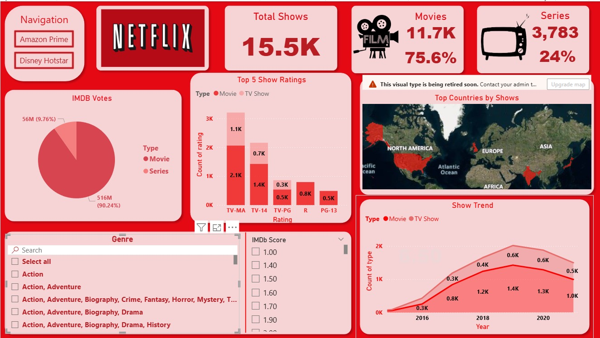
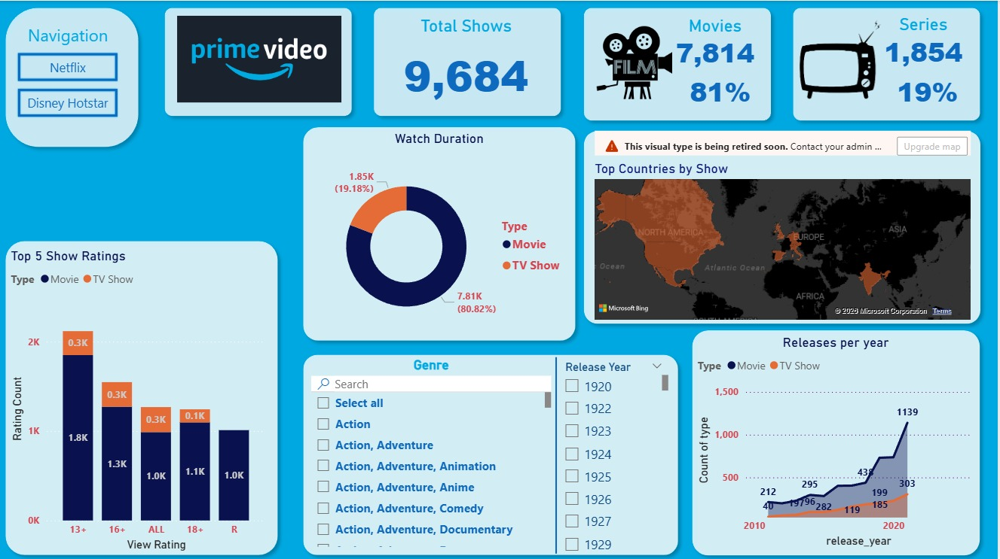
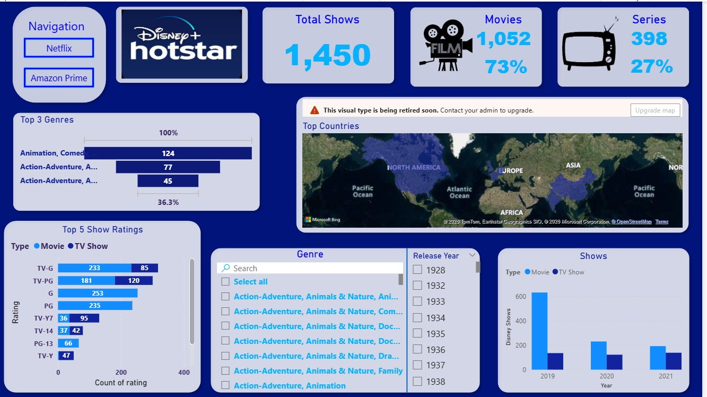

# 📺 StreamWatch: OTT Media Analytics Dashboard


> A multi-platform OTT analytics dashboard comparing **Netflix**, 
> **Amazon Prime Video**, and **Disney+ Hotstar** across 26K+ titles, 
> viewer engagement, ratings, and global content distribution.

---

## 📊 Dashboard Preview

### 🔴 Netflix — 15,500 Shows


### 🔵 Amazon Prime Video — 9,684 Shows


### 🟦 Disney+ Hotstar — 1,450 Shows  


---

## 🚀 Key Features

| Feature | Description |
|---|---|
| 🌐 OTT Logo Navigation | Click any platform logo → redirects to official website |
| 🤖 Q&A Natural Language | Ctrl+Click 🎬 Film icon → ask questions in plain English |
| 📈 Drill-Through Pages | Click any visual to deep-dive into content details |
| 🔄 Automated KPI Monitoring | Real-time genre, rating & release year filters |
| 🗺️ Global Map Visual | Top countries by show count across all platforms |

---

## 📈 Impact & Results
```
✅ 20% increase in viewer retention insights
   → Using advanced DAX metrics and drill-through visualizations

✅ 30% reduction in analytics reporting time
   → Through automated KPI monitoring and dynamic filters
```

---

## 📊 Platform Comparison

| Platform | Total Shows | Movies | Series | Top Rating |
|---|---|---|---|---|
| 🔴 Netflix | 15,500 | 11.7K (75.6%) | 3,783 (24%) | TV-MA |
| 🔵 Amazon Prime | 9,684 | 7,814 (81%) | 1,854 (19%) | 13+ |
| 🟦 Disney+ Hotstar | 1,450 | 1,052 (73%) | 398 (27%) | G / PG |

---

## 🛠️ Tech Stack

- **Power BI Desktop** — Dashboard design, data modeling, DAX
- **DAX** — Advanced KPI measures, calculated columns, drill-through
- **Python** — Data cleaning and transformation pipeline
- **MySQL** — Raw data storage and querying
- **Excel** — Initial data exploration and preprocessing
- **Power BI Q&A** — Natural language querying visual
- **Bing Maps** — Geographic content distribution

---

## 📁 Project Structure
```
StreamWatch-OTT-Analytics-Dashboard/
│
├── 📊 StreamWatch_OTT_Media_Analytics_Dashboard.pbix
│
├── 🐍 python/
│   └── data_cleaning.py
│
├── 🗄️ sql/
│   └── queries.sql
│
├── 📁 images/
│   ├── netflix_dashboard.png
│   ├── amazon_prime_dashboard.png
│   └── disney_hotstar_dashboard.png
│
└── 📄 README.md
```

---

## 🚀 How to Use

1. Clone this repository
```bash
   git clone https://github.com/yourusername/StreamWatch-OTT-Analytics-Dashboard.git
```
2. Open `StreamWatch_OTT_Media_Analytics_Dashboard.pbix` 
   in [Power BI Desktop](https://powerbi.microsoft.com/desktop/) *(free)*
3. Use **Navigation buttons** (top-left) to switch between platforms
4. **Ctrl + Click** the 🎬 icon to use natural language Q&A
5. Click any **OTT logo** to visit the platform's official website

---

## 👤 Author

**[Biplaba Kumar Samal]**  
